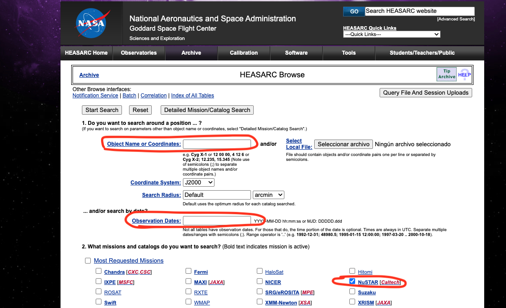
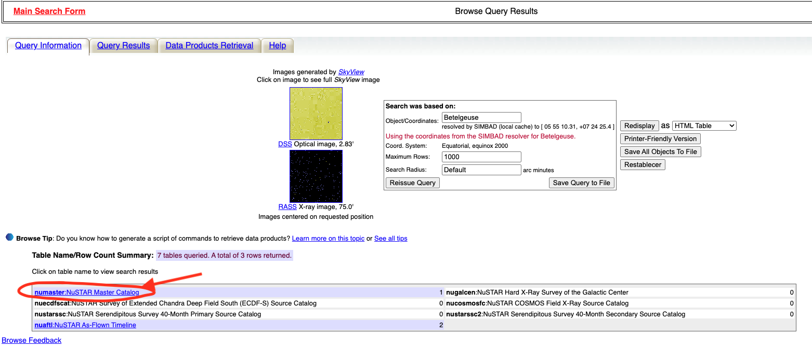

# Retrieving data from HEASARC (W3Browse)

You can find and download public data products from many missions (e.g., **NuSTAR**) via HEASARC’s W3Browse.

## 1) Open the W3Browse search page

* Go to: [https://heasarc.gsfc.nasa.gov/cgi-bin/W3Browse/w3browse.pl](https://heasarc.gsfc.nasa.gov/cgi-bin/W3Browse/w3browse.pl)

## 2) Choose mission/table and enter target

* In **“Object name or coordinates”**, enter the target name (resolved via SIMBAD/NED) *or* J2000 coordinates (e.g., `RA Dec` or `HH MM SS.s +DD MM SS`).
* Set a **Search Radius** if using coordinates (e.g., `60 arcsec`).
* In **“Mission and Data”**, select the mission/table you want (e.g., **NuSTAR Master Catalog**).

{.center-image width="50%"}

## 3) Run the search

* Click **Start Search** (top of the page).
* The **Master Table** opens with matching observations, click numaster.

{.center-image width="50%"}

## 4) Review and sort results

* Use the arrows in the column headers to **sort** (e.g., by exposure time, obs date, off-axis angle).

## 5) Select rows to retrieve

* For each dataset you want, tick the **checkbox** in the leftmost column of the row.
* In **“Data Products Retrieval:”** choose **all** to retrieve.
* Then, click on **Retrieve Data Products for selected rows**.

This opens a retrieval page where you can:
* Generate a **wget/curl script** for bulk download. Select **“Create Download Script”**
* Finally, copy and paste the wget comnads in to the terminal of the CLUSTER:
``` bash
wget -q -nH --no-check-certificate --cut-dirs=6 -r -w1 -l0 -c -N -np -R 'index*' -erobots=off --retr-symlinks https://heasarc.gsfc.nasa.gov/FTP/nustar/data/obs/05/3//30501012002/
```


