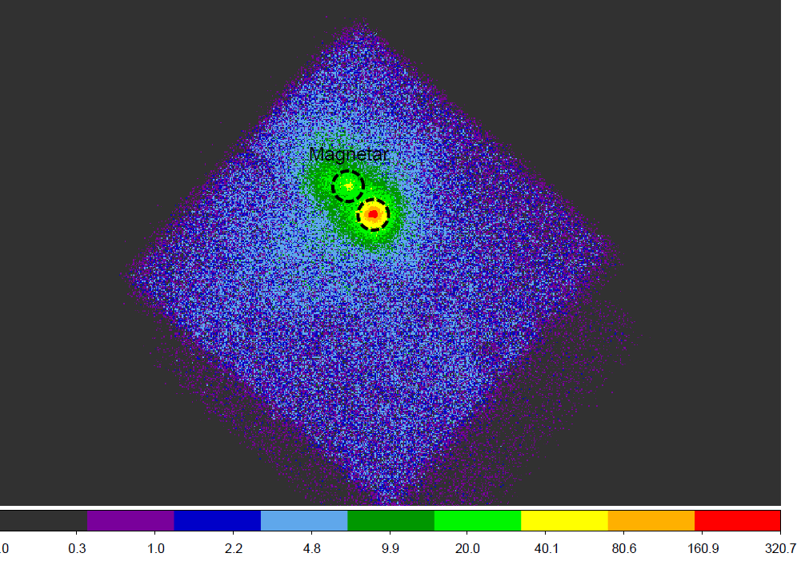

# NuSTAR Data Analysis Overview

NuSTAR data processing is organized into three stages:

1. **Data calibration** (Level 1 & 1a calibrated event files)
2. **Data screening** (Level 2 cleaned event files)
3. **Products extraction** (Level 3 science products)

Each stage can be run in sequence with **`nupipeline`**. The examples below assume a Unix-like shell and a working HEASoft/NUSTARDAS + CALDB setup.

---

# Step-by-Step

## 1) Run `nupipeline` (Stages 1 & 2)

Process raw data through calibration and screening to produce Level 2 (cleaned) event files.

```bash
# Example OBSID: 90901332001  (replace with your own)
nupipeline \
  indir=./90901332001 \
  steminputs=nu90901332001 \
  outdir=./out90901332001 \
  clobber=yes
```

This creates an output directory (here `./out90901332001`) containing Level 2 event files that are calibrated, cleaned using **Good Time Intervals (GTIs)**, and screened for **South Atlantic Anomaly (SAA)** passages.

```bash
cd ./out90901332001
```

---

## 2) Define source & background regions in DS9

NuSTAR has two co-aligned telescopes (FPMA, FPMB). Analyses are typically performed for each module separately, then combined during spectral fitting.
*(The examples below show FPMA only; repeat for FPMB as needed.)*

### 2.1 Load the Level 2 event file in DS9

```bash
# Replace filename with your Level 2 event file
ds9 nu90901332001A01_cl.evt
```

{.center-image width="50%"}

Create a **circular source region** centered on the target:

**Tips in DS9**

* Use *Edit → Region* to draw a circle.
* Change *Scale* to **Log** to enhance faint emission.
* Use *Analysis → Centroid* to center on the source (it may differ slightly from J2000 catalog coordinates).
* **Save regions in WCS / FK5 coordinates** (very important):
  *Region → Save Regions… → Coordinate System: WCS (FK5)*

Save as:

* Source region → `srcA.reg`
* Background region → `bgdA.reg` (choose a nearby, source-free area; avoid chip gaps and stray-light features)

> The NuSTAR background varies across the FoV and across the four CZT detectors on each focal plane. The **`nuproducts`** task correctly scales background using the **BACKSCAL** keyword, but your choice of background size and location affects the statistics—keep it close and clean.

---

## 3) Run `nuproducts` to extract Level 3 products

By default, **`nuproducts`** produces spectra, light curves, and images. Light curves and images default to the full NuSTAR bandpass (≈3–79 keV). The PHA spectrum spans the full channel range (channels 1–4096; ≈1.6–165 keV).

### 3.1 Standard extraction (FPMA)

```bash
nuproducts \
  indir=./out90901332001 \
  outdir=./productsA \
  instrument=FPMA \
  steminputs=nu90901332001 \
  srcregionfile=./out90901332001/srcA.reg \
  bkgregionfile=./out90901332001/bgdA.reg \
  bkgextract=yes \
  clobber=yes \
  > nuproducts_log.txt
```

This creates a `./productsA` directory with spectra (`.pha`), responses (`.arf`, `.rmf`), light curves (`.lc`), and images.

View quicklook products (example):

```bash
eog nu90901332001A_im.gif
```

---

## 4) Rebinning during `nuproducts`

You can group the spectrum on the fly with `rungrppha=yes` and set minimum counts per bin and PI channel limits.

```bash
# Example 1
nuproducts \
  indir=./outs/out30101045002 \
  instrument=FPMA \
  steminputs=nu30101045002 \
  outdir=./products30101045002 \
  srcregionfile=./outs/out30101045002/srcON.reg \
  bkgregionfile=./outs/out30101045002/bgdOFF.reg \
  extended=yes \
  rungrppha=yes \
  grpmincounts=30 \
  grppibadlow=35 \
  grppibadhigh=1909 \
  clobber=yes
```

```bash
# Example 2 (no background extraction; e.g., if reusing an existing background or for testing)
nuproducts \
  indir=./out30501012002 \
  instrument=FPMA \
  steminputs=nu30501012002 \
  outdir=./products30501012002_no_back \
  srcregionfile=./out30501012002/srcA.reg \
  bkgextract=no \
  rungrppha=yes \
  grpmincounts=30 \
  grppibadlow=35 \
  grppibadhigh=2100 \
  clobber=yes
```

---

## 5) Extract light curves in custom energy bands

By default, light curves use PI channels 35–1909 (~3–78 keV). Use `pilow`/`pihigh` to set a custom PI range (e.g., ~3–4 keV corresponds roughly to PI 210–227 in this example; confirm for your CALDB).

```bash
nuproducts \
  indir=./out30501012002 \
  instrument=FPMA \
  steminputs=nu30501012002 \
  outdir=./products_lc_3to4keV \
  srcregionfile=./out30501012002/srcA.reg \
  bkgregionfile=./out30501012002/bgd.reg \
  bkgextract=yes \
  pilow=210 \
  pihigh=227 \
  clobber=yes
```

---

## 6) Barycentric correction (light curves)

Apply barycentric correction to source light curves with **`barycorr`**. Use the correct *attorb* file for your observation and the target coordinates (J2000).

```bash
barycorr \
  infile=nu10012001002A01_sr.lc \
  outfile=nu10012001002A01_sr_corr.lc \
  orbitfiles=../pipeline_out/nu10012001002A.attorb \
  ra=187.2779154 \
  dec=2.0523883
```

---

## 7) Additional examples & utilities

### 7.1 Another `nupipeline` call (explicit instrument)

```bash
nupipeline \
  indir=./80512222001 \
  outdir=./out80512222001 \
  instrument=FPMA \
  steminputs=nu80512222001 \
  clobber=yes
```

### 7.2 Recompute sky coordinates with `nucoord`

```bash
nucoord \
  infile=nu80512218001A06_cl_seg0.evt \
  outfile=nu80512218001A06_cl_seg0_out.evt \
  mastaspectfile=nu80512218001_mast.fits \
  attfile=nu80512218001_att.fits \
  pntra=333.76540 pntdec=-10.84813 \
  optaxisfile=nu80512218001B_oa.fits \
  det1reffile=nu80512218001B_det1.fits \
  pixposfile=$CALDB/data/nustar/fpm/bcf/pixpos/nuApixpos20100101v001.fits \
  alignfile=$CALDB/data/nustar/fpm/bcf/align/nuCalign20100101v007.fits \
  teldef=$CALDB/data/nustar/fpm/bcf/teldef/nuA20100101v002.teldef \
  clobber=yes
```

### 7.3 Example `nuproducts` call for FPMB and specific segment

```bash
nuproducts \
  infile=./outs/out80512223001/nu80512223001B06_out_seg2_coord.evt \
  srcregionfile=./regions/23001_1411center.reg \
  bkgregionfile=./regions/23001_1411panda.reg \
  indir=outs/out80512223001 \
  outdir=./spectra/80512223001/segB2 \
  instrument=FPMB \
  steminputs=nu80512223001 \
  bkgextract=yes \
  clobber=yes
```

---

## 8) XSELECT workflow (manual GTI filtering & event extraction)

Interactive example:

```
fran:SUZAKU > read events
> Enter the Event file dir
>> [./]
> Enter Event file list
>> [nu80512218001A06_cl.evt]
Got new mission: NUSTAR
>>> Reset the mission ? [yes]
>>> Notes: XSELECT set up for NUSTAR
Time keyword is TIME in units of s
Default ...
fran:NUSTAR-FPMA > filter time scc
> Enter list of start and stop times [x]
  319958133,319959033
> Enter list of start and stop times
  [319958133,319959033]
Wrote GTIs to file fran_keybd_gti001.xsl
fran:NUSTAR-FPMA > extract events
extractor v6.10 20 Jan 2023
Getting FITS WCS Keywords
Doing file: /home/fran/PHD_projects/NuSTAR_SUN/SUN_DATA/outs/out80512218001/nu80512218001A06_cl.evt
100% completed
Total Good Bad: Time Phase Grade Cut
17896 3586 14310 0 0 0
Writing events file
3586 events written to the output file
===============================================================================
Grand Total Good Bad: Time Phase Grade Cut
17896 3586 14310 0 0 0
in 857.00 seconds
fran:NUSTAR-FPMA > save events
> Give output file name [./451274tmp_evt]
./nu80512218001A06_cl_seg0.evt
Wrote events list to file ./nu80512218001A06_cl_seg0.evt
> Use filtered events as input data file ? [no]
```

Condensed commands:

```bash
xselect
filter time scc
extract events
save events
```
---

## Key Reminders

* **Always save DS9 regions in WCS/FK5** coordinates.
* Inspect images for **stray light**, **ghost rays**, and **chip gaps**; adjust regions accordingly.
* For spectral grouping, ensure your choice (e.g., `grpmincounts`) matches the statistics used in your fitter (χ² vs. C-stat).
* Repeat the full procedure for **FPMB** to enable joint spectral fits.
