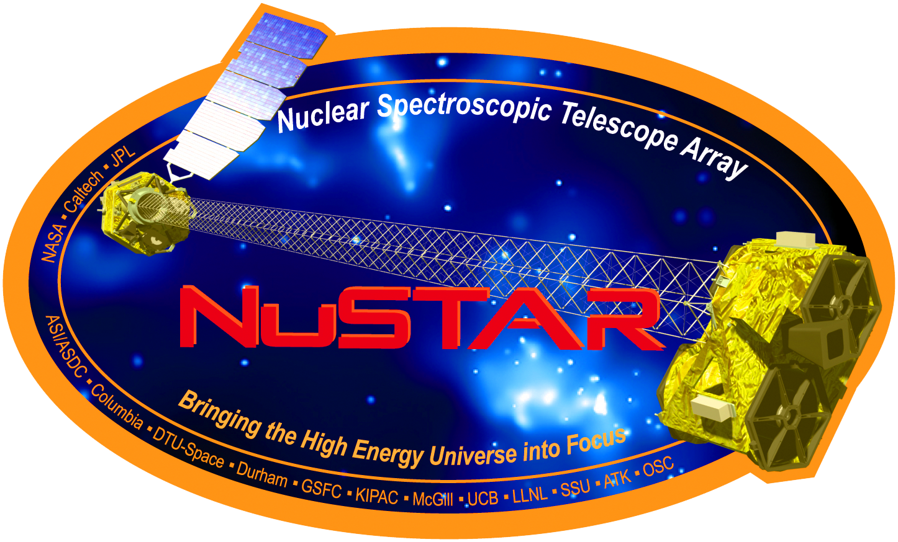
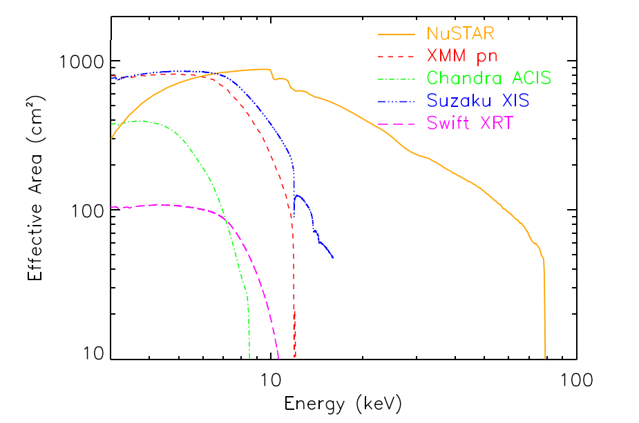

# NuSTAR — Nuclear Spectroscopic Telescope Array

NuSTAR (Nuclear Spectroscopic Telescope Array) is the **first space-based hard X-ray focusing telescope** (not using coded masks) that extends observations **from ~3 keV up to ~79 keV**. It was designed starting in 2008 and **launched in 2012** into a near-equatorial low-Earth orbit.  

By employing **grazing-incidence optics with multilayer coatings**, NuSTAR achieves **superior sensitivity and spatial resolution** in the high-energy regime compared to previous shadow cameras or coded mask instruments.

> **Important:** Most of the information in this tutorial was obtained from the  
> [NuSTAR Quickstart Tutorial Guide](https://heasarc.gsfc.nasa.gov/docs/nustar/analysis/nustar_quickstart_guide.pdf)

{.center-image width="50%"}

---

## Optics and Detectors

- **Optics (2 modules):** each module has **133 nested shells** coated with multilayers:  
  - **Pt/C** for the inner shells and **W/Si** for the outer ones.  
  - **Segmentation:** layers **1–69** are divided into **6 sextants**; **69–133** into **12**.  
    This segmentation **reduces weight** at the cost of a **slight decrease** in angular resolution compared to a monolithic mirror.
- **Geometry:** conical approximation to a **Wolter-I configuration**, optimized for **grazing-incidence reflection**.
- **Focal length:** approximately **10 m** between the optics and focal plane.
- **Focal plane (each telescope):** **2×2 CdZnTe detector array** (solid-state), each with **32×32 pixels** of **0.6 mm**, covering a **FOV ≈ 12′ × 12′**.  
  The two telescope/detector assemblies are **nearly identical**, allowing **image combination** to improve sensitivity.

---

## Performance Summary

| Property | Approximate Value |
|-----------|------------------|
| **Energy range** | ~3–79 keV (limited by the Pt K-edge at ≈ 78.4 keV) |
| **Angular resolution (optics)** | ~18″ FWHM; HPD ≈ 58″ |
| **Energy resolution (focal plane)** | ~400 eV FWHM @ 10 keV; ~0.9 keV FWHM @ 60 keV |
| **Timing accuracy** | ~65 μs for calibrated timestamps |
| **Optical modules** | 2 (images can be co-added) |
| **Detectors** | CdZnTe, 2×2 tiles per focal plane, 32×32 pixels per tile |

> **Note:** Values follow specifications reported in the technical literature  
> (e.g., Harrison et al., 2013; Bachetti et al., 2021).

{width="60%"}

*Effective area of NuSTAR compared with other X-ray missions. Based on Harrison et al. (2013).*

---

## Quick Use (in this course)

1. Check the **NuSTAR environment configuration** under the corresponding tab (`conda/envs`).  
2. Follow the tutorial **Data Archive** in order to learn how to download data from the archive.

---

## References

- Harrison, F. A. et al. (2013). *The Nuclear Spectroscopic Telescope Array (NuSTAR) High-Energy X-Ray Mission.*  
- Bachetti, M. et al. (2021). *Timing calibration and accuracy for NuSTAR.*

---

